# FlowSense AI — Advanced System Architecture & Workflow

---

## End-to-End System Flow

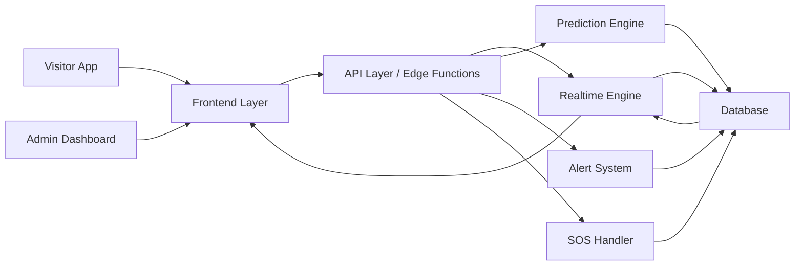

---

## Visitor Journey Flow

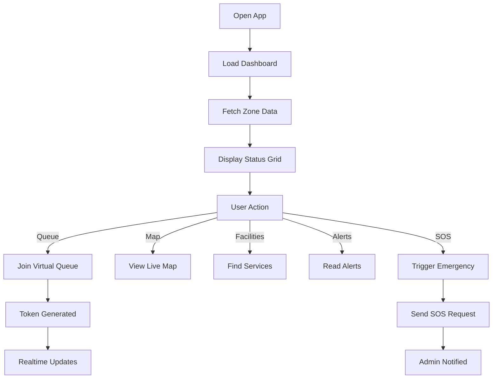

---

## Admin Workflow Flow

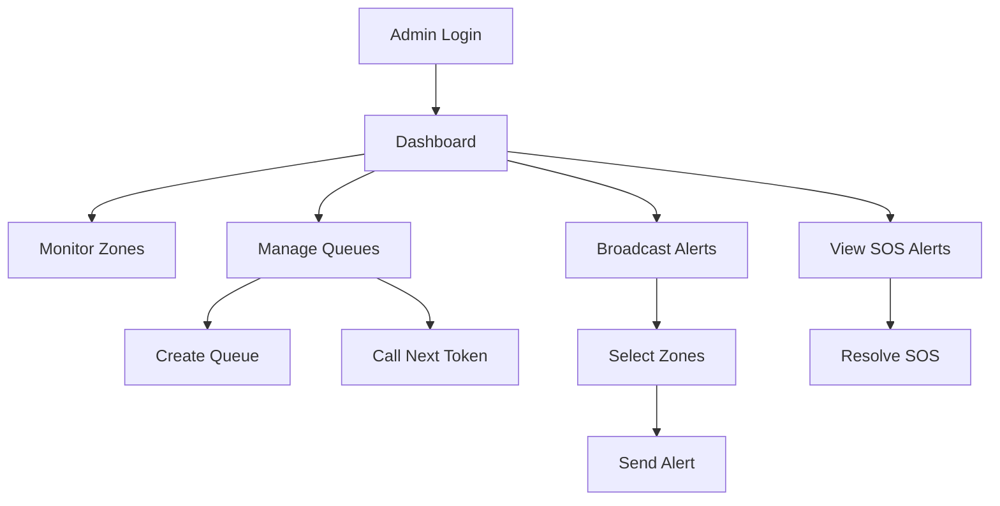

---

## Virtual Queue System Flow

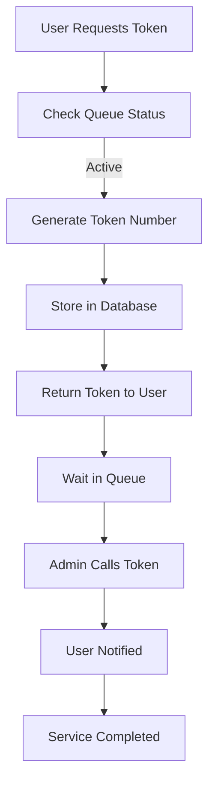

---

## SOS Emergency Flow

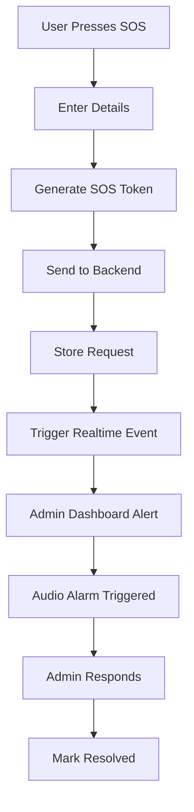

---

## Alert Broadcasting Flow

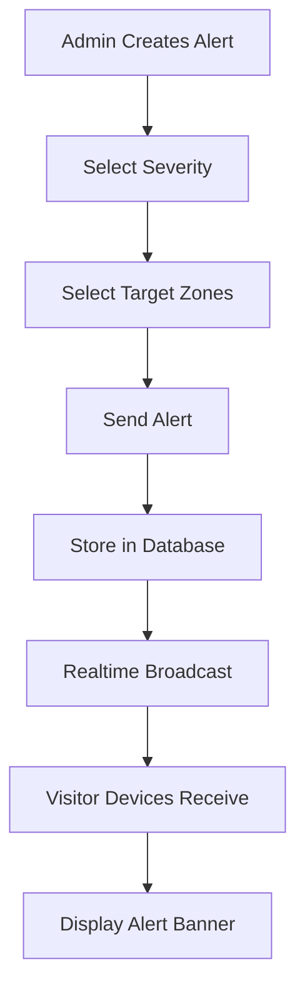

---

## Prediction Engine Flow

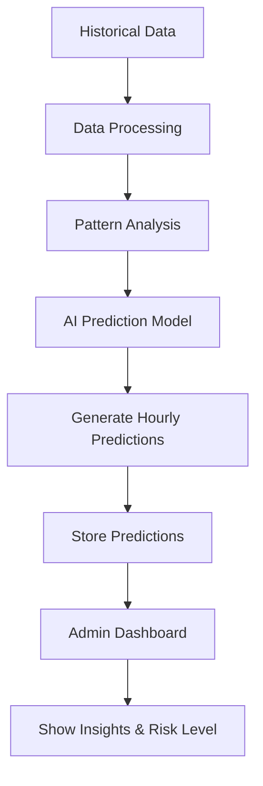

---

## Realtime System Flow

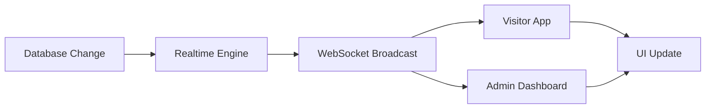

---

## Database Interaction Flow

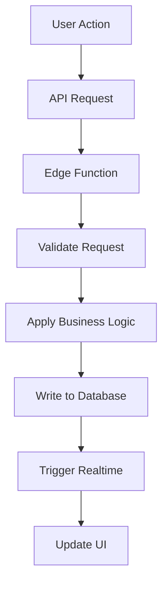

---

## Security Flow

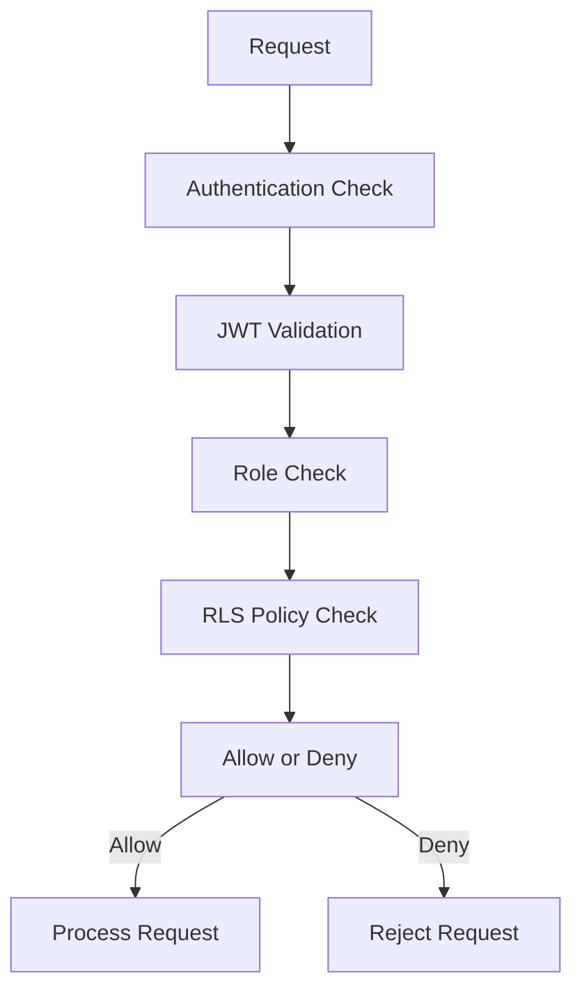

---

## System Architecture (Detailed)

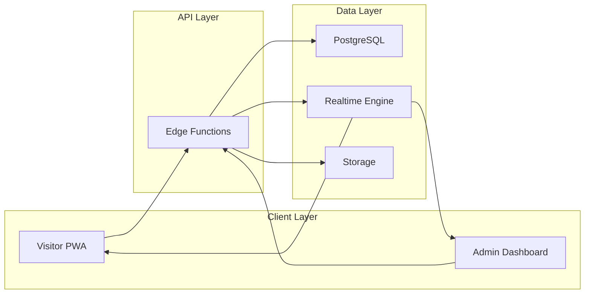

---

## Queue Token Lifecycle

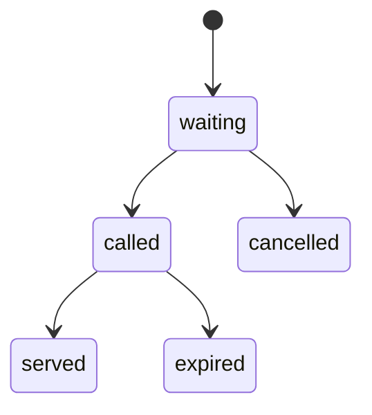

---

## Alert Lifecycle

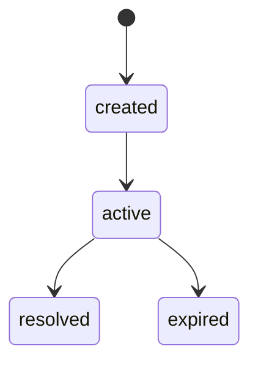

---

## SOS Lifecycle

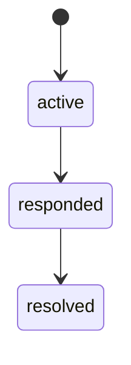

---

## Data Flow Summary

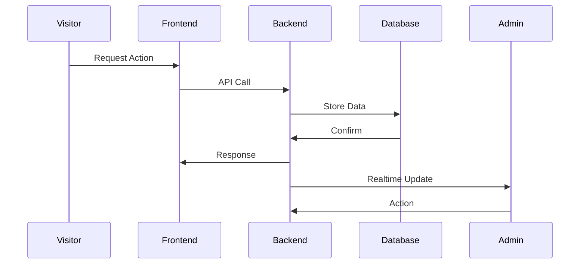

---

## System Advantages

- Fully real-time architecture
- Event-driven system design
- Modular and scalable backend
- Strong security with RLS and JWT
- Low-latency communication via WebSockets
- AI-driven predictive analytics
- Fault-tolerant microservice-style structure

---

## High-Level Architecture Summary

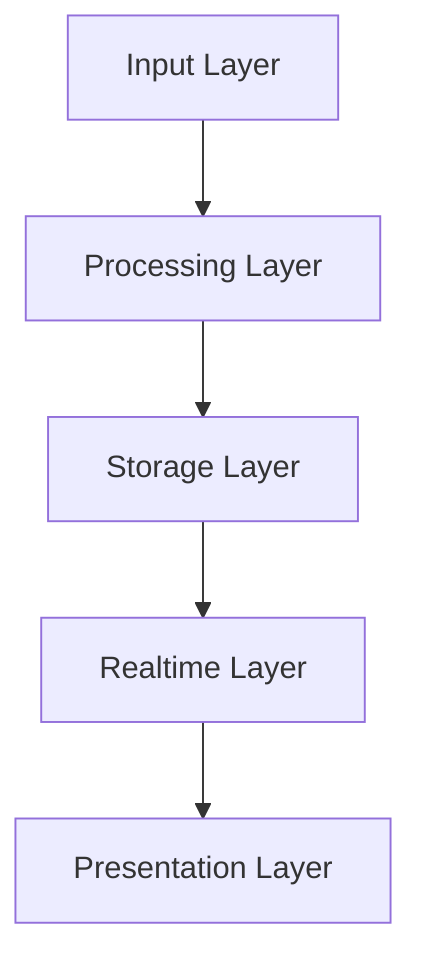

---

## Conclusion

FlowSense AI is designed as a highly scalable, real-time, event-driven system capable of handling large-scale crowd environments with precision, safety, and efficiency. The integration of predictive analytics, realtime communication, and modular architecture ensures reliability and future extensibility.
