

  

<h1 align="center">FlowSense AI</h1>

  <strong>Intelligent Crowd Management for India's Public Spaces</strong>

  
  
  
  
  

  <strong>Developer:</strong> Vansh Raj Singh &nbsp;|&nbsp; 
  <strong>Version:</strong> 1.0.0 &nbsp;|&nbsp; 
  <strong>Build:</strong> 2026.01.31

---

# Executive Summary

FlowSense AI is a real-time intelligent crowd management system designed for high-density public environments such as temples, railway stations, stadiums, and large-scale events.

It combines real-time monitoring, predictive analytics, and instant communication to ensure safety, optimize crowd flow, and improve visitor experience.

---

# Core Features and Working

## 1. Real-Time Crowd Monitoring

### Working
- Sensors or manual inputs continuously update crowd counts
- Data is stored in the database
- Realtime subscriptions push updates instantly to all clients

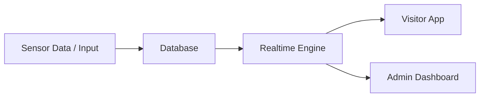

---

## 2. Virtual Queue System

### Working
- Users generate digital tokens instead of standing in queues
- System calculates estimated wait time dynamically
- Admin controls token flow

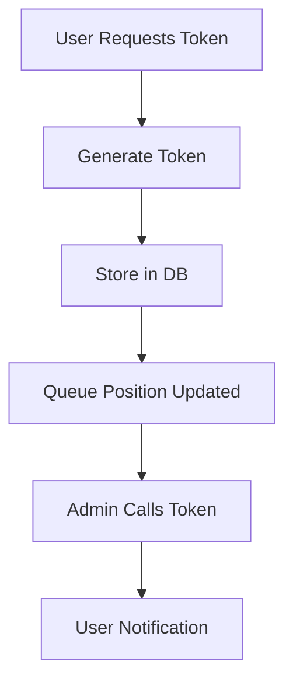

---

## 3. Interactive Crowd Map

### Working
- Each zone has real-time density data
- Color-coded visualization based on occupancy
- Updates instantly through realtime engine

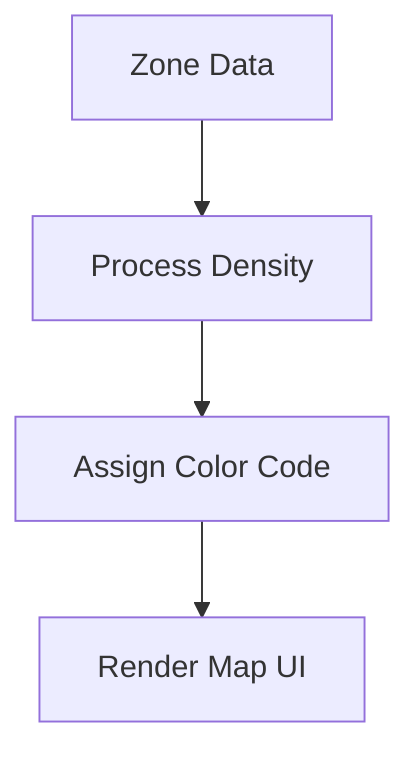

---

## 4. Emergency Alert System

### Working
- Admin creates alert with severity and zones
- Stored in database
- Broadcasted instantly to all users

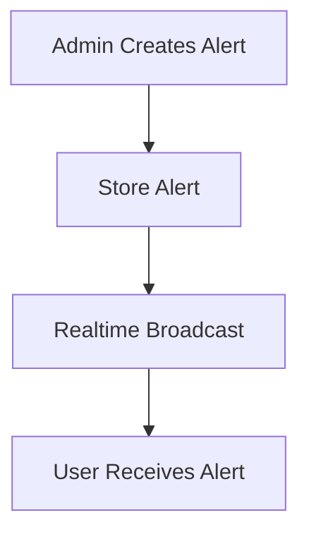

---

## 5. SOS Emergency System

### Working
- User triggers SOS
- Unique token generated
- Admin receives alert instantly

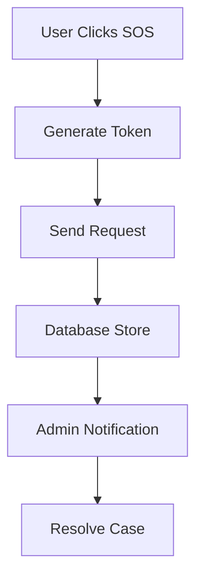

---

## 6. AI Prediction System

### Working
- Uses historical and real-time data
- Generates future crowd predictions
- Helps admins take proactive actions

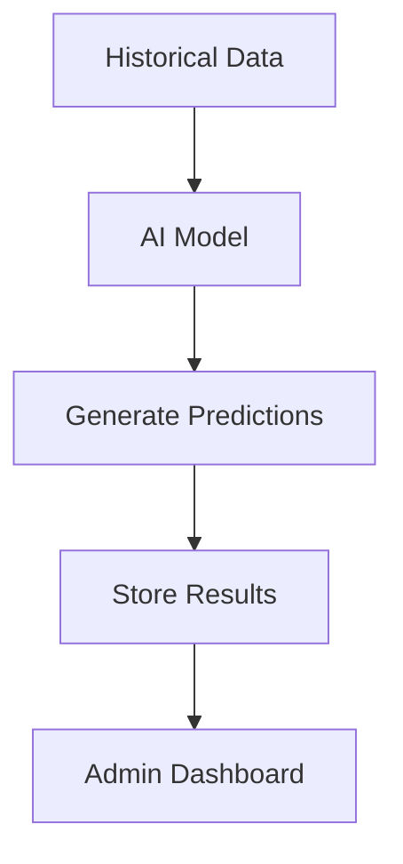

---

## 7. Facilities Locator

### Working
- Facilities mapped to zones
- Availability tracked in real-time
- Users can filter and locate nearby services

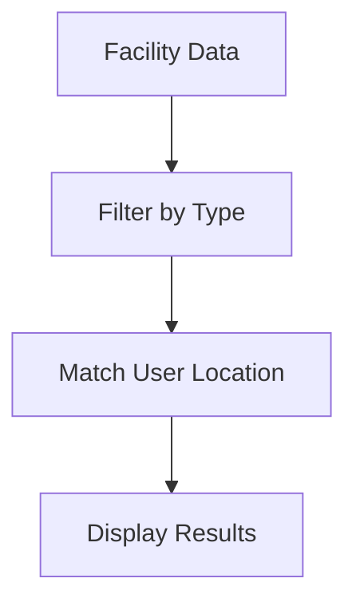

---

# Complete System Workflow

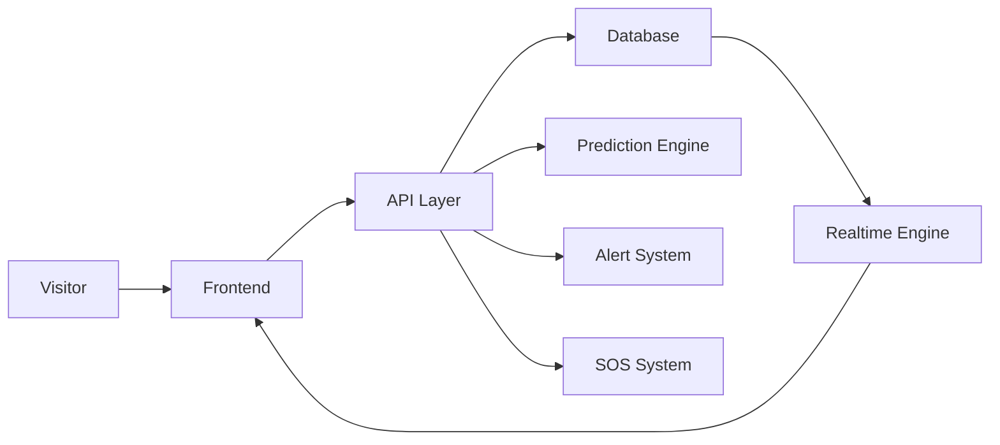

---

# Admin Workflow

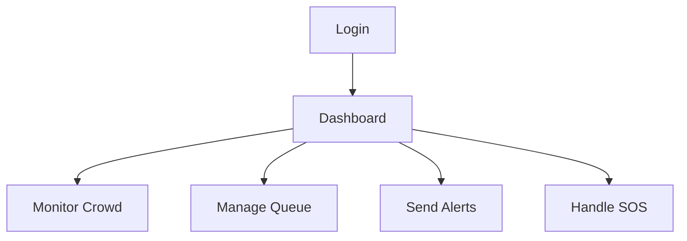

---

# Visitor Workflow

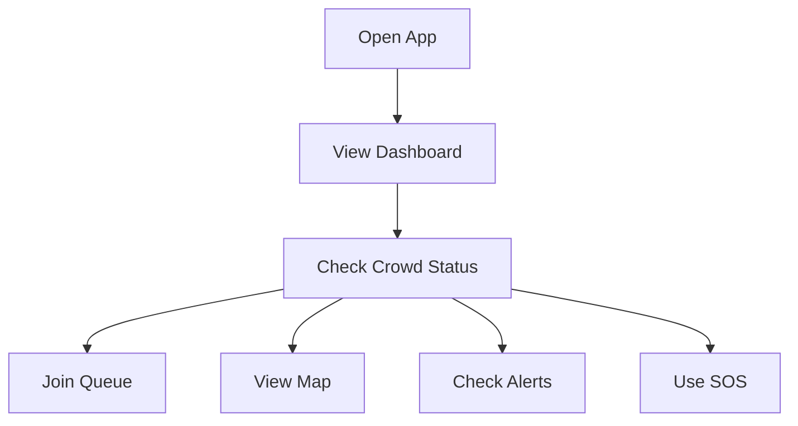

---

# Realtime Data Flow

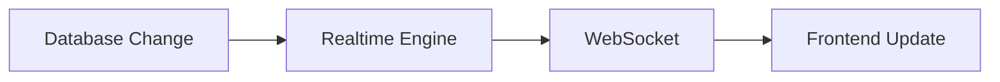

---

# Security Flow

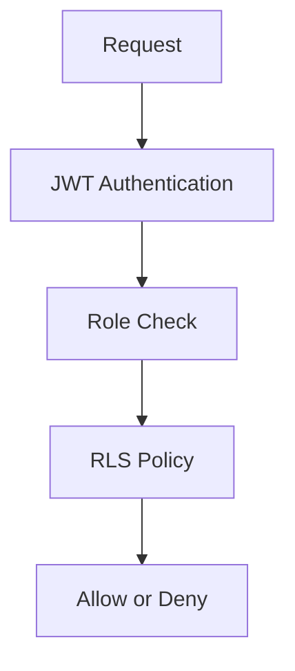

---

# Architecture Overview

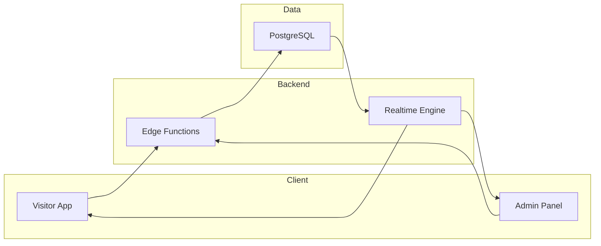

---

# Key Advantages

- Real-time monitoring and updates
- Digital queue system eliminates physical crowding
- AI-based predictions for proactive management
- Instant emergency communication
- Scalable and modular architecture
- Secure access control with RLS and JWT

---

# Conclusion

FlowSense AI is a complete intelligent system designed to solve real-world crowd management challenges using modern technologies. Its real-time capabilities, predictive intelligence, and modular design make it suitable for large-scale deployment across public infrastructures.
